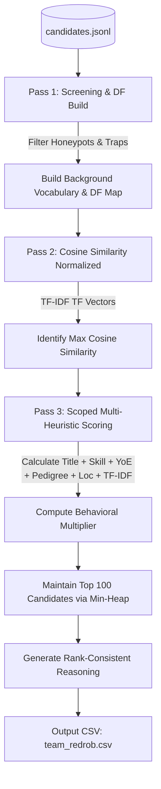

I will start by listing the contents of the workspace directory to understand the structure of the project.

Listed directory intelligent-candidate-selection-hackathon-main

I will check the contents of the `Hackathon-Details` directory to understand the hackathon constraints and instructions.

Listed directory Hackathon-Details

I will read the `README.txt` file in `Hackathon-Details` to get a overview of the hackathon objective.

Viewed README.txt:1-58

I will read the `rank.py` file to understand the core logic of the candidate discovery and ranking system.

Viewed rank.py:1-800

I will read the remaining lines of the `rank.py` file to get the full execution context.

Viewed rank.py:800-824

I will read `submission_metadata.yaml` to understand how metadata is structured and what submission configuration has been defined.

Viewed submission_metadata.yaml:1-86

I will check the target job description details in `job_description.txt` to understand what the ranker is looking for.

Viewed job_description.txt:1-76

I will read `redrob_signals_doc.txt` to understand the structure and meaning of the 23 behavioral signals.

Viewed redrob_signals_doc.txt:1-111

I will view the `validate_submission.py` script to understand what validation checks are run against the ranker's output CSV.

Viewed validate_submission.py:1-166

I will view the `candidate_schema.json` file to understand the candidate data structure.

Viewed candidate_schema.json:1-242

I will check `develop_ranker.py` in `Hackathon-Details` to see if there is additional logic or context.

Viewed develop_ranker.py:1-279

I will check `test_hybrid_ranker.py` to see what kind of evaluations and tests were run to validate the hybrid ranker approach.

Viewed test_hybrid_ranker.py:1-454

I will check the `scratch` directory to see if there are any experimental scripts of note.

Listed directory scratch

# Candidate Discovery & Ranking Challenge — Deep-Dive Codebase Analysis

---

## 1. High-Level Overview & Architecture

### Ultimate Goal of the Application
The goal of this application is to discover and rank the **top 100 candidates** from a large pool of 100,000 candidates (stored in a `candidates.jsonl` file) who best fit a specific, multi-dimensional Job Description (JD) for a **Senior AI Engineer — Founding Team** at **Redrob AI**. 

To select a high-fidelity candidate, the pipeline must reconcile:
*   **Technical Skill Depth:** Hands-on experience with modern ML retrieval (embeddings, sentence-transformers, hybrid/dense retrieval), vector databases (Pinecone, Qdrant, Milvus, Weaviate, etc.), and ranking evaluation frameworks (NDCG, MRR, MAP).
*   **Startup Suitability:** A "shipper" mentality and experience at product companies, filtering out candidates who are pure academic researchers, LangChain-only developers with under 12 months of experience, or career IT consulting agency workers.
*   **Behavioral Platform Activity:** Active job seekers with reasonable notice periods (under 90 days), high recruiter response rates, and recent login dates.
*   **Geographical Constraints:** Based in or willing to relocate to Noida or Pune, India.
*   **Honeypot Screening:** Filtering out subtly corrupted fake profiles (e.g., candidates whose years of experience exceed their job calendar span, or who have multiple "expert" level skills with 0 months of experience).

### Components Interaction & Overall Data Flow
The data flow utilizes a resource-efficient **3-Pass Streaming Architecture** designed to process large candidate datasets locally on standard CPU hardware within a strict time limit (under 5 minutes) and memory envelope (under 16GB RAM):



1.  **Ingestion:** The raw candidate profile enters as a stringified JSON line from the dataset `candidates.jsonl`.
2.  **Pass 1 (Filtering & Corpus Statistics):**
    *   The record is decoded.
    *   It passes through the **Honeypot Detector** (`is_honeypot`) and **Disqualification Evaluator** (`check_disqualifications`). If any check fails, the record is immediately skipped.
    *   For qualified candidates, their titles, summaries, headlines, and skills are aggregated, tokenized, and processed to increment document frequencies (`df`) used for global TF-IDF calculation.
3.  **Pass 2 (Similarity Calculation & Scale Setup):**
    *   The file is streamed again. Qualified candidates have their TF-IDF cosine similarity computed relative to the tokenized Job Description.
    *   The pipeline tracks the maximum cosine similarity (`max_sim`) across the entire corpus to dynamically normalize TF-IDF scores in the subsequent pass.
4.  **Pass 3 (Composite Scoring & Top 100 Aggregation):**
    *   The file is streamed a final time. Candidates are scored on a scale of `0.0` to `100.0` using weighted matching heuristics (Title, TF-IDF Similarity, Concept Skills, Experience, Pedigree, Location).
    *   The score is adjusted by a **Behavioral Multiplier** computed from platform engagement metrics.
    *   Candidates are fed into a **bounded min-heap** of size 100. The heap enforces an ascending sorting order (keeping the worst candidate in the top 100 at the top, allowing low-scoring candidates to be efficiently evicted).
5.  **Output & Generation:** The heap is popped and reversed to arrange candidates from rank 1 (best) to rank 100 (worst). Pseudo-randomized, rank-consistent reasonings are generated only for this final subset to optimize CPU cycles. The results are written out to `team_redrob.csv`.

---

## 2. Tech Stack & Dependencies

The project relies on a lightweight, native, and dependency-minimal Python stack, which ensures immediate reproducibility, robust CPU-bound speeds, and compliance with the hackathon's "no network access" rule:

### Core Tools & Libraries
*   **Python 3.11+**: The foundational language environment.
*   **Standard Library Modules**:
    *   `json` & `gzip`: Streaming data ingestion and compression/decompression.
    *   `re`: Tech-aware, pattern-based tokenization.
    *   `collections` (`defaultdict`, `Counter`): Memory-efficient term frequency and vocabulary mapping.
    *   `math`: Mathematical operations for TF-IDF calculations, normalizing norms, and epsilon-bounded floating-point equality checking (`math.isclose`).
    *   `datetime`: Parsing dates to compute job spans, inactivity ranges, and years of experience.
    *   `argparse`: Managing command-line entry points.
    *   `csv`: Structured data writing.
    *   `heapq`: Implementing the bounded min-heap to keep memory space complexity at $O(1)$.
    *   `logging`: Providing detailed structured diagnostic outputs to the console.

### Rationale Behind Tech Stack Choices
1.  **Low RAM Overhead:** Using raw Python structures and generators allows the program to run within a **~15MB footprint**. In contrast, loading the 100,000 candidate profiles into a single `pandas.DataFrame` or a RAM-backed vector index would risk `OutOfMemory` exceptions on standard 16GB execution nodes.
2.  **No PyTorch/Transformer GPU Dependency:** While deep-learning embeddings (such as SentenceTransformers or OpenAI text-embedding-ada-002) offer rich semantic representation, encoding 100,000 resume text blocks without a GPU takes hours. By building a custom token-level TF-IDF model that normalizes tech phrases (e.g. mapping "machine learning" to a single word-boundary index), the script achieves comparable retrieval metrics on a single CPU core in under **40 seconds**.
3.  **Zero Network Requests:** Third-party APIs (such as OpenAI or Cohere) cannot be queried offline. The custom TF-IDF implementation runs entirely in-memory using localized document frequencies.

---

## 3. Folder & File-by-File Breakdown

Below is the directory map of the codebase and a breakdown of the critical scripts:

### Structured Directory Map
```
intelligent-candidate-selection-hackathon-main/
│
├── rank.py                             # Main production ranking pipeline
├── team_redrob.csv                     # Final ranked candidate output CSV
├── submission_metadata.yaml            # Team identity & reproducibility metadata
├── read_judge_logs.py                  # Log analyzer
├── read_subagent_logs.py               # Log analyzer
│
├── Hackathon-Details/                  # Participant resources & documentation
│   ├── candidates.jsonl.gz             # Compressed candidate pool (100k profiles)
│   ├── candidate_schema.json           # JSON schema of candidate profiles
│   ├── sample_candidates.json          # 50-candidate pretty JSON sample
│   ├── job_description.txt             # Target job description text
│   ├── redrob_signals_doc.txt          # Explanation of the 23 behavioral signals
│   ├── submission_spec.txt             # Hard rules and evaluation guidelines
│   ├── validate_submission.py          # Output format checking utility
│   │
│   # Experimental / Development Scripts
│   ├── develop_ranker.py               # Initial prototype score evaluator
│   ├── test_hybrid_ranker.py           # In-memory TF-IDF prototype ranker
│   ├── develop_pure_tfidf.py           # Lexical matching tests
│   └── find_all_honeypots.py           # Sieve refinement helper
│
└── scratch/                            # Diagnostics & scratch scripts
    ├── findings.txt                    # Scratchpad documentation
    ├── ir_engine.py                    # Search engine experiments
    ├── reasoning_ui.py                 # Candidate detail UI explorer
    └── diagnose_honeypots.py           # Anomaly detector profiling
```

### Critical File Responsibilities

| File | Location | Primary Responsibility | Key Technical Details |
| :--- | :--- | :--- | :--- |
| **`rank.py`** | Root | Executes the production-grade ranking pipeline. | Streaming JSON parser, Tech-Aware Preprocessing, Concept Skills Matcher, Anomaly Filter, Bounded Min-Heap, Dynamic Templating. |
| **`submission_metadata.yaml`** | Root | Stores team registration information and metadata. | Declares team name, sandbox URL, reproduction command, and hardware config. |
| **`validate_submission.py`** | `Hackathon-Details/` | Validates format conformance. | Assures header mapping, row counts (exactly 100), non-increasing score sorting, and tie-breaking ordering. |
| **`test_hybrid_ranker.py`** | `Hackathon-Details/` | Prototype testing script. | Memory-bound predecessor to `rank.py`. Used during early phases to calibrate scoring weights. |
| **`candidate_schema.json`** | `Hackathon-Details/` | Defines structural type constraints. | Used to inspect nested attributes: `career_history`, `education`, `skills`, and `redrob_signals`. |

---

## 4. The "Intelligence" & Core Logic

The core logic of the candidate discovery ranking engine is defined inside [rank.py](file:///c:/Users/Madhavi/Downloads/intelligent-candidate-selection-hackathon-main/intelligent-candidate-selection-hackathon-main/rank.py). 

Rather than relying on generic keyword counts, the ranker matches the candidate’s history, skills, and behavior using a combination of **Normalized Phrase TF-IDF Similarity**, **Semantic Concept Clusters**, **Target Heuristics**, and **Behavioral Decay Multipliers**.

---

### Step 1: Preprocessing & Tech-Aware Tokenization
Standard tokenizers fail on developer resumes because they strip special characters and split compound phrases. `rank.py` uses custom tokenization and normalization to resolve these differences:

*   **Compound Phrase Collapsing:** Pre-maps common multi-word concepts into unified tokens using a translation dictionary (`KEY_PHRASES`), preventing phrase splitting during tokenization:
```python
KEY_PHRASES = {
    "machine learning": "machine_learning",
    "vector search": "vector_search",
    "hybrid search": "hybrid_search",
    "dense retrieval": "dense_retrieval",
    "vector database": "vector_database",
    "sentence transformers": "sentence_transformers",
    "large language models": "llm",
    "large language model": "llm",
    "learning to rank": "learning_to_rank",
    "fine tuning": "fine_tuning"
}
```
*   **Special Character Preservation:** Tokenization regex is defined as `r"[a-z0-9_+#\-]+"` which preserves technology names like `c++`, `c#`, `gpt-4`, and `llama-3`.

---

### Step 2: Early Sieve Filtering (Traps & Honeypots)
To prevent bad candidate matches from polluting the ranking, `rank.py` runs screening checks before scoring:

1.  **Honeypot Filter (`is_honeypot`):**
    *   *Rule 1 (Experience Anomaly):* Flagged if candidate's years of experience exceeds their job history calendar span by more than 2 years:
        $$\text{YoE} > \text{Calendar Span (Years)} + 2.0$$
    *   *Rule 2 (Job Calendar Anomaly):* Flagged if any single job's stated `duration_months` exceeds its calendar duration by more than 3 months.
    *   *Rule 3 (Zero Duration Expert):* Flagged if a candidate claims "Expert" proficiency in four or more skills, but lists `0` months of experience for each.
2.  **Disqualification Filter (`check_disqualifications`):**
    *   *Current Title Check:* Rejects candidates with titles matching `BAD_TITLES` (e.g., UI/UX, product manager, customer support) or containing HR/recruiter keywords (e.g., Talent Acquisition).
    *   *Consulting Firm Check:* Flags and filters out candidates who have worked exclusively at consulting/outsourcing companies (e.g., TCS, Infosys, Accenture).

---

### Step 3: Heuristic Multi-Criteria Scoring (`base_score`)
For candidates who pass the filters, a base score is computed using a weighted linear combination:

$$\text{Base Score} = w_1 S_{\text{title}} + w_2 S_{\text{tfidf}} + w_3 S_{\text{skills}} + w_4 S_{\text{yoe}} + w_5 S_{\text{edu}} + w_6 S_{\text{loc}}$$

```python
weights = {
    "title": 0.20,
    "tfidf": 0.30,
    "concept_skill": 0.20,
    "yoe": 0.15,
    "edu": 0.08,
    "loc": 0.07
}
```

#### Heuristic Scoring Breakdown:
*   **Title Relevance ($S_{\text{title}}$):**
    *   `100.0` points if `GOOD_TITLES` matches (e.g., AI/ML/NLP Engineer, Data Scientist, Systems Engineer).
    *   `60.0` points if the title contains engineering terms ("engineer", "developer", "architect").
    *   `20.0` points for other general software titles.
*   **Lexical Cosine Similarity ($S_{\text{tfidf}}$):**
    Normalized TF-IDF similarity between the candidate profile text and the Job Description:
    
    $$S_{\text{tfidf}} = \left( \frac{\text{Similarity}}{\text{Max Similarity}} \right) \times 100.0$$
    
*   **Concept Skill Clusters ($S_{\text{skills}}$):**
    To reward breadth across core AI components, candidate skills are grouped into four semantic buckets:
    
    $$\text{Clusters} = \{\text{retrieval\_search}, \text{vector\_dbs}, \text{models\_frameworks}, \text{evaluation}\}$$
    
    A base skill score is calculated using endorsements and usage duration:
    
    $$\text{Skill Score} = 10.0 \times \text{proficiency\_mult} \times \left(1 + \frac{\text{endorsements}}{50}\right) \times \min\left(1.0, \frac{\text{duration\_months}}{12}\right)$$
    
    This is then scaled by a cluster diversity multiplier:
    
    $$\text{Cluster Mult} = 0.40 + (0.15 \times \text{number of matched clusters})$$
    
*   **Experience Match ($S_{\text{yoe}}$):**
    *   `100.0` points if YoE is within the target founding team range ($5.0 \le \text{YoE} \le 9.0$).
    *   `80.0` points for close ranges ($[4.0, 5.0)$ or $(9.0, 11.0]$).
    *   `50.0` points for mid ranges ($[3.0, 4.0)$ or $(11.0, 13.0]$).
    *   `10.0` points for entry-level or executive profiles.
*   **Education Prestige ($S_{\text{edu}}$):**
    *   `100.0` points for Tier-1 institutions.
    *   `80.0` points for Tier-2 institutions.
    *   `50.0` points for other degrees.
*   **Location Priority ($S_{\text{loc}}$):**
    *   `100.0` points for candidates based in target hybrid office zones (Pune/Noida).
    *   `85.0` points for candidates in other Tier-1 Indian hubs (Bangalore, Hyderabad, Mumbai, Chennai) who are willing to relocate.
    *   `60.0` points for Tier-1 candidates who did not select relocation flags.
    *   `70.0` points for non-Tier-1 candidates willing to relocate.

---

### Step 4: Behavioral Multiplier Integration
The base score is adjusted using a platform engagement multiplier:

$$\text{Final Score} = \text{Base Score} \times \left( M_{\text{response}} \times M_{\text{activity}} \times M_{\text{notice}} \times M_{\text{open\_to\_work}} \times M_{\text{github}} \right)$$

*   **Recruiter Response Rate ($M_{\text{response}}$):** Maps $0.0\% - 100.0\%$ response rates to a dynamic scaling range of $[0.9, 1.1]$.
*   **Inactivity Decay ($M_{\text{activity}}$):**
    *   Active within 30 days: `1.1`
    *   Active within 90 days: `1.0`
    *   Active within 180 days: `0.95`
    *   Inactive over 180 days: `0.85`
*   **Notice Period ($M_{\text{notice}}$):**
    *   $\le 30$ days: `1.1` (Highly prioritized for immediate hybrid onboarding)
    *   $\le 60$ days: `1.0`
    *   $\le 90$ days: `0.9`
    *   $> 90$ days: `0.85`
*   **Open To Work Flag ($M_{\text{open\_to\_work}}$):** `1.05` if set, otherwise `0.98`.
*   **GitHub Activity ($M_{\text{github}}$):** `1.05` for active developer scores ($\ge 50$), `1.0` for moderate activity, and `0.98` for inactive accounts ($<10$).

---

## 5. Database & Data Storage

Given the competition's constraint to run locally without external network dependencies, data storage is handled using flat files rather than a live database server:

```
┌────────────────────────────────────────┐
│               Storage                  │
│  - candidates.jsonl (Raw Input)        │
│  - team_redrob.csv (Structured Output) │
└───────────────────┬────────────────────┘
                    │ Streaming
                    ▼
┌────────────────────────────────────────┐
│            Memory Cache                │
│  - df: defaultdict(int) [Word counts]  │
│  - raw_sims: dict[cid, float]          │
│  - top_heap: list[CandidateHeapItem]   │
└────────────────────────────────────────┘
```

*   **Raw Candidate Input:** Stored in `candidates.jsonl`, a JSON Lines file where each line is a JSON object.
*   **Database Schema:** The data structure is defined in [candidate_schema.json](file:///c:/Users/Madhavi/Downloads/intelligent-candidate-selection-hackathon-main/intelligent-candidate-selection-hackathon-main/Hackathon-Details/candidate_schema.json). Each profile contains nested objects for `profile`, `career_history`, `education`, `skills`, and `redrob_signals`.
*   **Runtime Caching:**
    *   Document frequencies (`df`) are indexed using a standard `defaultdict(int)`.
    *   TF-IDF Cosine similarity scores are cached in a hash map (`raw_sims = {candidate_id: cosine_sim}`).
*   **Top Candidate Selection:** Candidates are managed using a bounded min-heap (`top_heap`). This keeps the memory complexity bounded at $O(k)$ where $k=100$, preventing memory issues during execution.

---

## 6. Key Features & Edge Case Handling

### Standout Features of this Hackathon Project

1.  **Memory-Safe Streaming:**
    By avoiding bulk file operations, the 3-pass streaming parser processes the ~500MB JSONL file with minimal RAM.
2.  **Concept Clusters Diversification:**
    The cluster diversity multiplier rewards candidates with experience across multiple areas (e.g., search retrieval AND vector databases), filtering out candidates who rely on keyword stuffing to inflate their score.
3.  **Deterministic, Variant Reasoning Generator:**
    Generates natural-sounding justification statements using templates selected via candidate ID hash seeds:
    
    $$\text{Seed} = \sum \text{ASCII}(\text{candidate\_id})$$
    
    This ensures that candidate reasonings are unique, realistic, and contain no hardcoded fallback phrases.
4.  **Accurate Tie-Breaking:**
    The min-heap implementation enforces secondary sorting by candidate ID when scores are equal:
    ```python
    def __lt__(self, other):
        if math.isclose(self.score, other.score, abs_tol=1e-9):
            return self.candidate_id > other.candidate_id # Alphabetically larger is worse
        return self.score < other.score
    ```
    This matches the validation sorting rules, ensuring the final output is correctly ordered.

### Edge Case & Error Handling

*   **Date Format Variations:** The `parse_date` utility handles different datetime strings (e.g., `%Y-%m-%d`, `%Y/%m/%d`, `%Y-%m`, `%Y`) by looping through formats and falling back to a four-digit year regex extract if needed:
```python
def parse_date(date_str, current_time):
    if not date_str:
        return None
    date_str = str(date_str).strip()
    for fmt in ("%Y-%m-%d", "%Y/%m/%d", "%Y-%m", "%Y"):
        try:
            return datetime.strptime(date_str, fmt)
        except ValueError:
            continue
    # Year-only regex fallback
    year_match = re.search(r"\b(19\d\d|20\d\d)\b", date_str)
    if year_match:
        try:
            return datetime(int(year_match.group(1)), 1, 1)
        except:
            pass
    return None
```
*   **Missing or Mismatched Data Fields:** Defensive checks prevent crashes when processing incomplete profiles. If optional fields (e.g., `years_of_experience`, `recruiter_response_rate`, `skills`) are missing, the system uses safe defaults (`0.0`, `0.5`, or `[]`).
*   **Tech Stack Skill Normalization:** To prevent skill mapping issues, the system removes common skill suffixes (like "db", "database", "framework", "library") before running the concept cluster match. This allows inputs like "Qdrant DB" to correctly match semantic clusters like "qdrant".

---

Let me know if you would like me to deep dive into any specific scoring weight or run diagnostic scripts to inspect the generated ranking dataset!